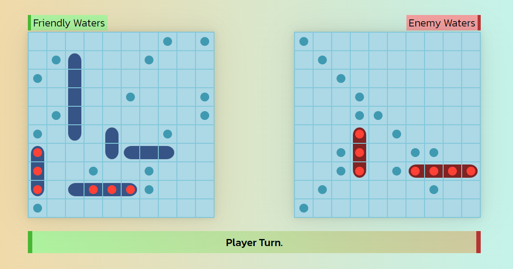

# Odin-Battleship

[Live link.](https://x6nenko.github.io/Odin-Battleship/)

## Project tasks.
- [x] Ship class.
- [x] Gameboard class.
- [x] Player class.
- [x] Game class.
- [x] DOM module.
- [x] Place ships by Drag and Drop (made only for PC version).
- [x] Polished the intelligence of the computer.